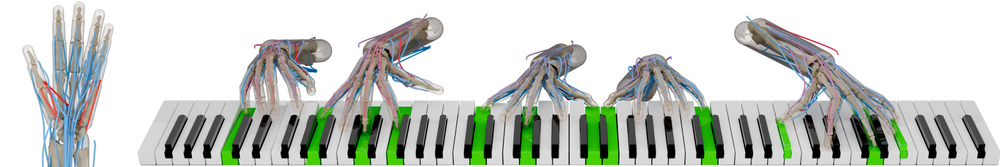

# MUSIC: Learning Muscle-Driven Dexterous Hand Control

This is the official implementation for _*MUSIC: Learning Muscle-Driven Dexterous Hand Control*_. [[Webpage](https://pei-xu.github.io/music)] [[Youtube](https://www.youtube.com/tt1D36gE8zM)]

TODO:
- [x] hand model
- [x] reference motion (https://huggingface.co/datasets/xupei0610/MUSIC)
- [x] training code (joint-driven)
    - We provide pretrained models in `pretrained/joint`. To visualize the performance, please run

            # Evaluation
            python main.py cfg/joint.py --note notes/017-1_fingering.txt --ckpt pretrained/joint/017-fingering --test 
            python main.py cfg/joint.py --note notes/017-1_nofingering.txt --ckpt pretrained/joint/017-nofingering --test
    
    - To train your own model, please (1) download the reference motion dataset and put it into the `motions` folder, and (2) refer to 
    [notes/README.md](notes) for the details of note file definition. 

            # Train
            python main.py cfg/joint.py --note notes/017-1_fingering.txt --ckpt <checkpoint_directory>

        Right after the training start, it will read the reference dataset by operning all the files in the `motions` folder. In some OS, the command `ulimit -n 4096` needs to run first, to increase the number of files that can be opened by one process.

- [ ] training code (muscle-driven)
- [ ] more pretrained models
